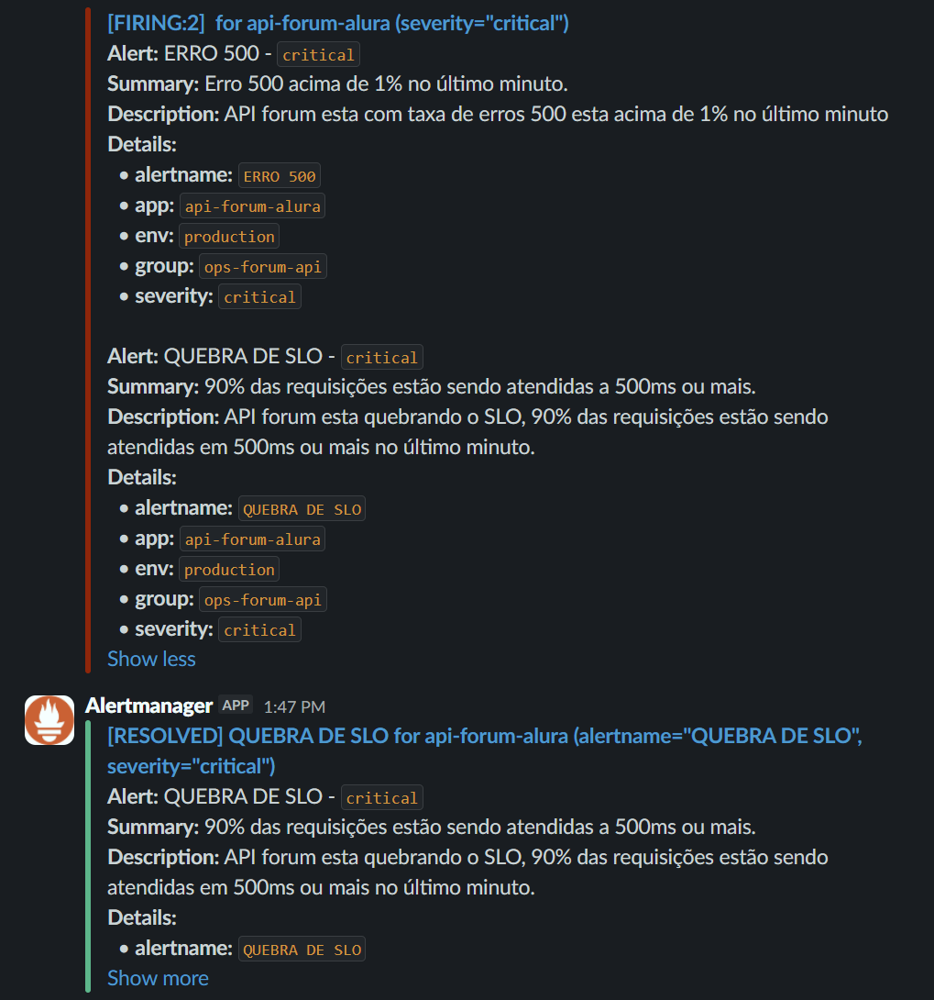

# 📊 Monitoramento, Alertas e Dashboards com Prometheus, Alertmanager e Grafana

Este repositório demonstra uma **stack completa de monitoramento e observabilidade** utilizando **Prometheus**, **Alertmanager** e **Grafana**, orquestrada via **Docker Compose**.

O projeto monitora uma **API (Forum API)** baseada em **Spring Boot**, coletando métricas, avaliando **SLOs**, disparando **alertas automáticos** (erros HTTP 500 e alta latência) e exibindo **dashboards no Grafana**, com notificações enviadas para o **Slack**.

---

## 🧩 Arquitetura da Solução

```
Client
   |
   v
Nginx (Proxy Reverso)
   |
   v
Forum API (Spring Boot)
   |        |
   v        v
 MySQL    Redis

Prometheus -----> /actuator/prometheus
      |
      v
Alertmanager -----> Slack
      |
      v
Grafana (Dashboards)
```

---

## 🛠️ Tecnologias Utilizadas

- Docker & Docker Compose
- Prometheus
- Alertmanager
- Grafana
- Nginx
- MySQL 5.7
- Redis
- Spring Boot Actuator + Micrometer

---

## 📦 Pré-requisitos

- Docker
- Docker Compose

Verifique a instalação:

```bash
docker --version
docker-compose --version
```

---

## ▶️ Como executar o projeto

Na raiz do projeto, execute:

```bash
docker-compose up -d
```

Acompanhar logs:

```bash
docker-compose logs -f
```

Parar todos os serviços:

```bash
docker-compose down
```

---

## 🌐 Acessos importantes

| Serviço | URL |
|------|-----|
| API (via Nginx) | http://localhost |
| Health Check | http://localhost/actuator/health |
| Métricas da API | http://localhost/actuator/prometheus |
| Prometheus | http://localhost:9090 |
| Alertmanager | http://localhost:9093 |
| Grafana | http://localhost:3000 |

**Credenciais padrão do Grafana**  
- Usuário: `admin`  
- Senha: `admin` (alterar no primeiro acesso)

---

## 📊 Prometheus

O **Prometheus** é responsável por:

- Coletar métricas da aplicação
- Armazenar séries temporais
- Executar consultas **PromQL**
- Avaliar regras de alerta

### Arquivos de configuração

- `prometheus/prometheus.yml` – targets e scraping
- `prometheus/alert.rules` – regras de alerta (SLO e erros)

### Métricas monitoradas

- Latência de requisições HTTP
- Taxa de erros 5xx
- Requisições por segundo
- Uso de memória da JVM
- Threads e Garbage Collection

---

## 🚨 Alertas e Alertmanager

Os alertas são definidos em `alert.rules` e processados pelo **Alertmanager**.

### Alertas configurados

- **Erro HTTP 500 (critical)**  
  Dispara quando a taxa de erros 500 ultrapassa **1% no último minuto**.

- **Quebra de SLO (critical)**  
  Dispara quando **90% das requisições** são atendidas em **500ms ou mais**.

### Exemplo de alerta no Slack

A imagem abaixo demonstra um alerta real disparado no Slack:



### Alertmanager

Responsável por:
- Agrupar alertas
- Evitar alertas duplicados
- Encaminhar notificações para o Slack

Configuração:
- `alertmanager/alertmanager.yml`

---

## 📈 Grafana

O **Grafana** é utilizado para **visualização das métricas coletadas pelo Prometheus**, por meio de **dashboards interativos**.

### Integração

- Prometheus configurado como **Data Source**
- Dashboards focados em aplicação e SRE

### Dashboards comuns

- JVM (Heap, GC, Threads)
- HTTP Requests (latência e status codes)
- Taxa de erros 5xx
- Indicadores de SLO / SLI

Os dados do Grafana são persistidos no volume:

```
./grafana
```

---

## 🔐 Redes Docker

A stack utiliza redes Docker isoladas para maior segurança:

- `database` → MySQL
- `cache` → Redis
- `api` → Comunicação interna da aplicação
- `monit` → Prometheus, Alertmanager e Grafana
- `proxy` → Exposição externa via Nginx

---

## 🎯 Objetivo do Projeto

- Demonstrar **monitoramento de aplicações com Prometheus**
- Implementar **alertas baseados em SLO e erros**
- Visualizar métricas com **Grafana**
- Integrar **Alertmanager com Slack**
- Aplicar boas práticas de Docker Compose
- Servir como base para estudos de **observabilidade e SRE**

---

## 📌 Próximos passos

- Versionar dashboards do Grafana
- Criar runbooks para alertas críticos
- Adicionar exporters para MySQL e Redis
- Incluir tracing distribuído (OpenTelemetry)

---

## 👤 Autor

**Franklin Oliveira**  
Projeto para estudos de **monitoramento, alertas e observabilidade com Prometheus** 🚀
